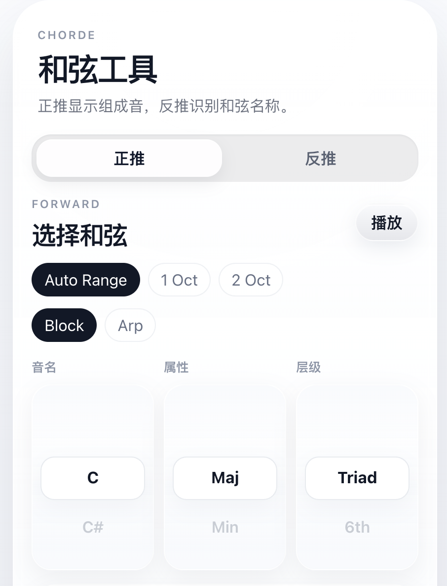
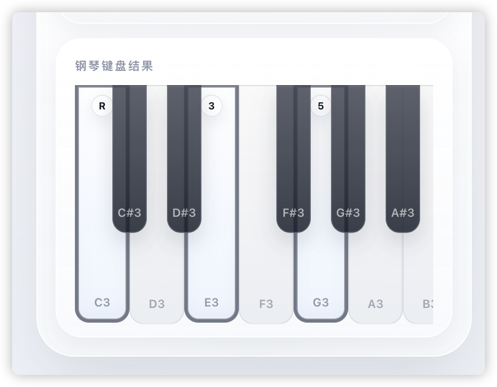
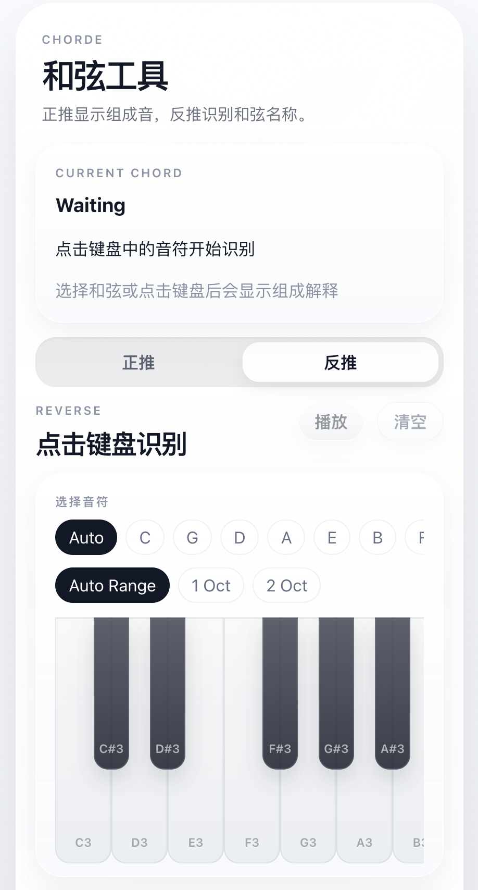

# ChordE

ChordE 是一个基于钢琴键盘的和弦工具，支持 **和弦正推** 与 **和弦反推**。

- `正推模式`：选择根音与和弦类型，在钢琴键盘上显示对应音符
- `反推模式`：直接点击钢琴键，由系统识别最可能的和弦名称
- `音频播放`：默认使用真实钢琴采样，缺失采样时自动回退到 Web Audio 合成音

## 页面截图

### 第一步：在正推模式中构建和弦

通过 3 列滚动选择器选择：

- 根音
- 和弦属性
- 和弦层级 / 扩展



### 第二步：在键盘上查看和弦音

所选和弦会直接显示在钢琴键盘上，并带有更清晰的目标标记和级数提示。



### 第三步：切换到反推模式

反推模式进入时默认是空状态，方便你直接点击键盘输入音符进行识别。



## 功能特性

### 和弦正推

- 3 列滚动选择器：
  - 根音
  - 和弦属性
  - 和弦层级 / 扩展
- 在钢琴键盘上显示目标和弦音
- 显示和弦组成级数，例如 `R`、`3`、`5`、`b7`、`9`
- 键盘范围切换：
  - `Auto Range`
  - `1 Oct`
  - `2 Oct`
- 播放方式切换：
  - `Block`
  - `Arp`

### 和弦反推

- 直接在钢琴键盘上点击音符
- 自动识别最可能的和弦名及候选结果
- 支持转位 / `slash chord` 显示，例如 `C/E`
- 支持按调性偏好优化结果排序
- 可将识别结果一键回填到正推模式

### 覆盖的和弦类型

当前已覆盖较完整的一组常用和弦类型，包括：

- 大三、小三、减三、增三
- `sus2`、`sus4`、`7sus2`、`7sus4`、`9sus4`
- `6`、`m6`、`6/9`
- `7`、`maj7`、`m7`、`mMaj7`、`dim7`、`m7b5`、`maj7b5`
- `add9`、`add11`
- `9`、`maj9`、`m9`
- `11`、`maj11`、`m11`
- `13`、`maj13`、`m13`
- `7b9`、`7#9`、`7b5`、`7#5`、`alt`、`maj7#5`

## 界面说明

整个界面采用偏移动端的展示方式：

- 即使在桌面端，也保持居中、竖向、手机尺寸的主工作区
- 使用卡片式信息组织
- 选择器交互参考 iOS 风格
- 钢琴键盘上的目标键与已选键做了强化标记

## 技术栈

- React
- TypeScript
- Vite
- Vitest

## 本地运行

### 环境要求

- Node.js 18+
- npm 9+

### 安装依赖

```bash
npm install
```

### 启动开发环境

```bash
npm run dev
```

开发服务器默认监听 `0.0.0.0`。

### 构建生产版本

```bash
npm run build
```

### 运行测试

```bash
npm test
```

## 钢琴采样

项目当前兼容 `tonejs-instruments` 风格的钢琴采样文件名，采样目录为：

```text
public/samples/
```

示例文件名：

```text
C3.mp3
Cs3.mp3
D3.mp3
...
B4.mp3
```

如果某个采样文件缺失，ChordE 会自动回退为 Web Audio 合成音。

## 采样来源与归属

当前仓库内使用的钢琴采样来源于：

- [nbrosowsky/tonejs-instruments](https://github.com/nbrosowsky/tonejs-instruments)
- 代码许可：`MIT`
- 样本许可：`CC BY 3.0`
- 上游仓库 `sample-source-info.txt` 标注钢琴采样来源为 `VSO2`

另见：

- [public/samples/ATTRIBUTION.txt](public/samples/ATTRIBUTION.txt)

## 项目结构

```text
src/
  components/
    PianoKeyboard.tsx
  data/
    chordFormulas.ts
  lib/
    audio.ts
    chordDetection.ts
    music.ts
  App.tsx
```

## 当前实现行为

- 正推模式按实际 MIDI 键位高亮目标音
- 反推模式只高亮用户真实点击的键
- 反推排序会优先考虑：
  - 精确匹配
  - 更常见、更简洁的命名
  - 更合理的低音 / 转位关系
  - 可选的调性偏好

## 后续可扩展方向

- 更深入的和声分析
- MIDI 键盘输入
- URL 状态分享
- 更强的 voicing 感知识别
- 更丰富的调性 / 音阶辅助工具

## 许可证说明

本仓库源码部分遵循仓库自身的许可证策略。

第三方音频采样仍然遵循其上游原始许可证。
